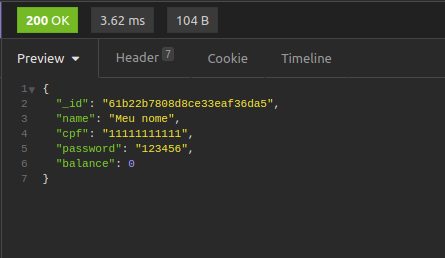

# Boas vindas ao repositório do projeto Account Manager!

Olá seja bem vindo(a) ao meu projeto Account Manager, projeto é uma API de gerenciamento de contas desenvolvido em Node Js utilizando-se de JWT, Frisby, Jest e MongoDB.

---

# Sumário

- [Habilidades treinadas](#habilidades-treinadas)
- [Instruções para acessar o projeto](#instruções-para-acessar-o-projeto)
- [A aplicação](#a-aplicação)

# Habilidades treinadas

- Arquitetura de Software.
- Criação de API com Node Js.
- Testes automatizados com Frisby e Jest.
- Manipulação de banco de dados não relacional (MongoDb)

---

## Instruções para acessar o projeto:

1. Clone o repositório
  * `git clone git@github.com:LeoFuna/account-manager.git`.
  * Entre na pasta do repositório que você acabou de clonar:
    * `cd account-manager`

2. Instale as dependências:
  * `npm install`

3. Caso possua o mongoDb instalado, inicie o mesmo.
  * Caso não tenha instalado, instale-o.
    * [Página para Instalação](https://docs.mongodb.com/manual/installation/)

4. Crie um arquivo .env na raiz da aplicação e insira os dados baseando-se no modelo .model.env

5. Inicie a aplicação:
  * `npm start`

6. Agora utilize alguma ferramenta para testar endpoints de APIs.
  * [Sugestão: Insomnia](https://insomnia.rest/download)
  * Os endpoints disponíveis são:
    *  Cria uma nova conta: `/account [POST]`
    *  Faz login em conta: `/login [POST]`
    *  Realiza depósito em conta: `/account/deposit [PUT]` Obs: Necessita estar logado
    *  Realiza transferência entre contas: `/account/transfer [PUT]` Obs: Necessita estar logado
    *  Pega os dados de uma conta: `/account [GET]` Obs: Necessita estar logado

---

# A aplicação

### 1. Criando nova conta
Exemplo de um corpo para criar nova conta.
 

 
Exemplo da resposta recebida.
 

  
### 2. Fazendo login na conta
Exemplo de um corpo para login.
 

 
Exemplo da resposta recebida.
 

  
### !!! Próximas respostas necessitam sempre do token no Header conforme abaixo !!!

  
### 3. Pegando todos os dados de uma conta
Exemplo da resposta recebida.
 

  
### 4. Depositando na conta
Exemplo de corpo para depositar em conta.
 

 
Exemplo da resposta recebida.
 

  
### 5. Transferindo entre contas
Exemplo de corpo para transferência entre contas.
 

 
Exemplo da resposta recebida.
 

  

# Desafio de Backend

Não faça um fork desse projeto, crie um repositório no seu perfil do GitHub. Pode criar privado mesmo, sem problemas.
Assim que terminar é só compartilhar o código com nosso usuário [devdigitalrepublic](https://github.com/devdigitalrepublic) e entrar em contato com a gente.

Boa sorte e divirta-se! ;)
